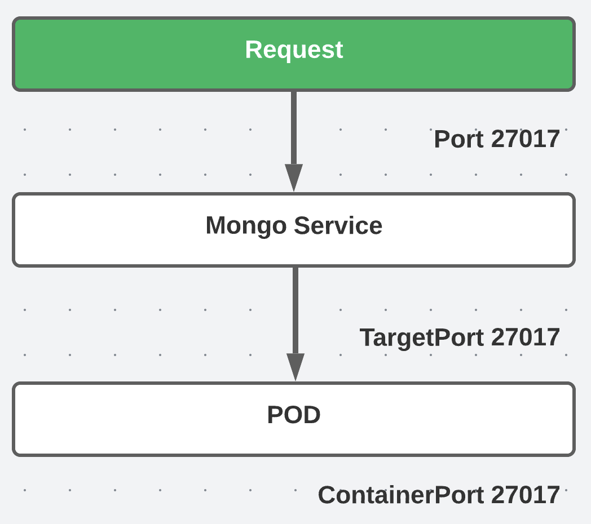

## Deployment

```yaml
apiVersion: apps/v1
kind: Deployment
metadata:
  name: mongo-deployment
  labels:
    app: mongo
spec:
  replicas: 1
  selector:
    matchLabels:
      app: mongo
  template:
    metadata:
      labels:
        app: mongo
    spec:
      containers:
      - name: mongodb
        image: mongo:5.0
        ports:
        - containerPort: 27017
```

### Template:

- Configuration for a kubernetes Pod.

### Labels:

- You can give any K8s resource a label.
- The label is a key/value pair that are attached to K8s resources.
- Labels do not provide uniqueness. All Pod replicas will have the same label.
- For Pods, label is a required field

```yaml
labels:
    app: mongo
```

- Identify sets of resources for a `Deployment` using `matchlabels`

```yaml
spec:
  replicas: 3
  selector:
    matchLabels:
      app: mongo
```

## Service

```yaml
apiVersion: v1
kind: Service
metadata:
  name: mongo-service
spec:
  selector:
  #this is how the service and pod will find each other (ln: 15)
    app: mongo
  ports:
    - protocol: TCP
      port: 27017
      # target port should always be the same and the container port (ln: 21)
      targetPort: 27017
```



## Run the following commands when you want to create an EBS volume
```bash
eksctl utils associate-iam-oidc-provider --region=us-east-1 --cluster=<CLUSTER_NAME> --approve

eksctl create iamserviceaccount --name ebs-csi-controller-sa --namespace kube-system --cluster <CLUSTER_NAME> --attach-policy-arn arn:aws:iam::aws:policy/service-role/AmazonEBSCSIDriverPolicy --approve  --role-only  --role-name AmazonEKS_EBS_CSI_DriverRole

eksctl create addon --name aws-ebs-csi-driver --cluster <CLUSTER_NAME> --service-account-role-arn arn:aws:iam::$(aws sts get-caller-identity --query Account --output text):role/AmazonEKS_EBS_CSI_DriverRole --force
```
